# Reinforcement Learning

Reinforcement learning is an area of machine learning, concerned with how software agents ought to take actions in an environment so as to maximize some notion of cumulative reward. In this project, a custom Maze problem needs to be solved in which there are certain flags in the maze which are to be collected and the goal is to reach the end of maze. Another part of this project is to solve OpenAI Gym environment problems, like MountainCar-v0 and Acrobot-v1.

* Tested on: Kubuntu 16.04.3, Intel i5-4200U (4) @ 2.600GHz 4GB
* Python 2.7, OpenCV 3.2

**Maze**

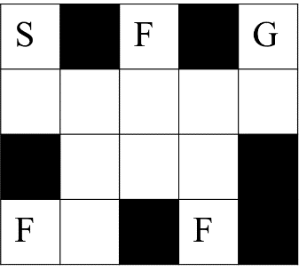 The first part of this project is to solve Maze problem and find optimal policy for each state and optimal Q-values (action values) for each state-action pair. “S” is the starting position and “G” is the goal position. There are three flags located at “F” and the goal of a learning agent is to collect the flags and escape the maze through the goal state as soon as possible. The total number of states are 112 and the total number of actions are 4 `(UP, DOWN, LEFT, RIGHT)`.

**MountainCar-v0**

A car is on a one-dimensional track, positioned between two "mountains". The goal is to drive up the mountain on the right; however, the car's engine is not strong enough to scale the mountain in a single pass. Therefore, the only way to succeed is to drive back and forth to build up momentum. The state vector for MountainCar-v0 is [position, velocity].

**Acrobot-v1**

The acrobot system includes two joints and two links, where the joint between the two links is actuated. Initially, the links are hanging downwards, and the goal is to swing the end of the lower link up to a given height.  

The state vector for Acrobot-v1 is:  
`[cos(theta1), sin(theta1), cos(theta2), sin(theta2), theta_dot1, theta_dot2]`.

## Challenge Description

* Solve Maze problem and find optimal policy for each state and optimal Q-values (action values) for each state-action (112x4) pair.
* Implement Q-learning and apply it to Maze and learn its Q-values for 5000 steps.
* Work with Acrobot-v1 and MountainCar-v0 environments in OpenAI Gym and apply the Q-learning algorithm to these environments by either discretizing the state space or using function approximation.
* Experiment with different action selection rules and different values for hyperparameters.

## Value Iteration

Value iteration is a basic approach to compute the optimal strategy or policy for this problem. The basic idea is, given certain policy, use backward operation to estimate how good the agent can achieve at certain state. The objective of value iteration is to compute an ideal Value function V* that maximizes the long term expected reward. This is achieved by following the Bellman equation:

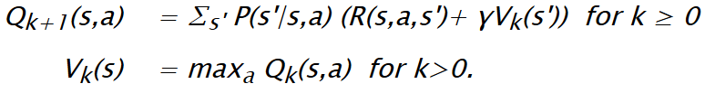

This process is repeated until convergence of Values. This essentially improves the value by choosing those (S, A) pairs that maximize the reward and hence the value. The discount factor is added to solve the St. Petersburg paradox. In this project the discount factor is fixed to 0.

## Q-Learning

Q-learning is a reinforcement learning technique used in machine learning. The technique does not require a model of the environment. Q-learning can handle problems with stochastic transitions and rewards, without requiring adaptations.

For any finite Markov decision process (MDP), Q-learning eventually finds an optimal policy, in the sense that the expected value of the total reward return over all successive steps, starting from the current state, is the maximum achievable. Q-learning can identify an optimal action-selection policy for any given finite MDP.

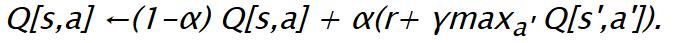

## Results

### Flag-Capture Action Values (**ε**-greedy)

| 1 | 2 | 3 | 4 |
| ----------- | ----------- | ----------- | ----------- |
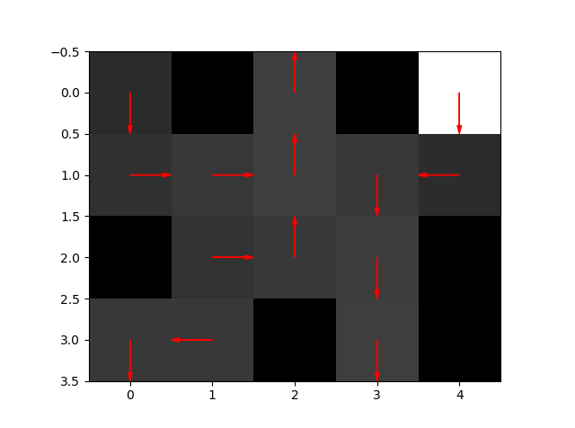 | 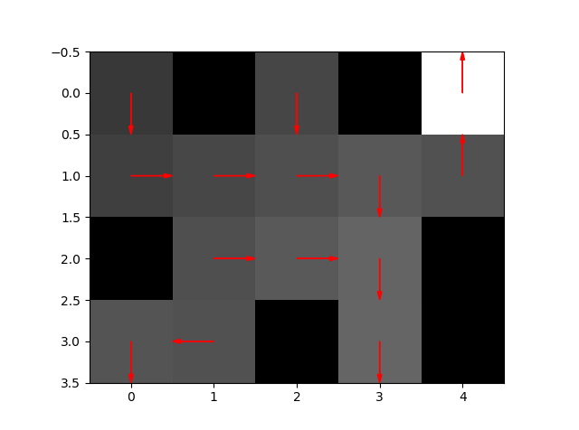  | 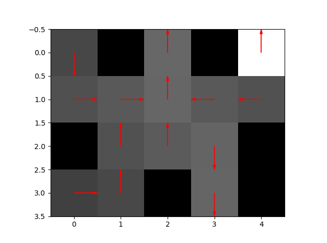  | 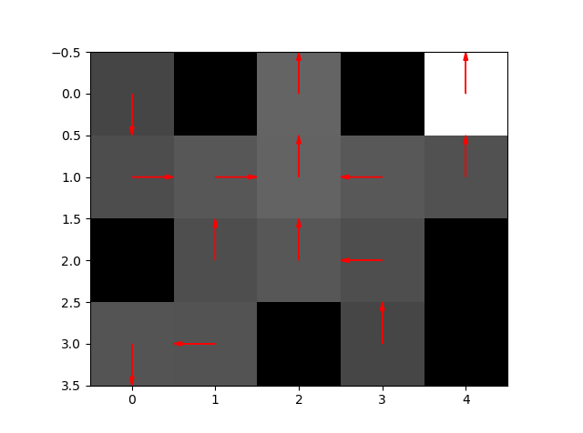 

| 5 | 6 | 7 | 8 |
| ----------- | ----------- | ----------- | ----------- |
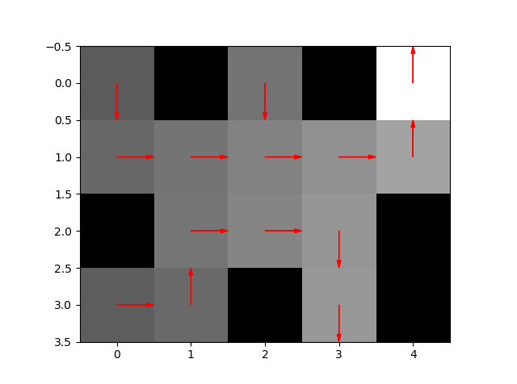 | 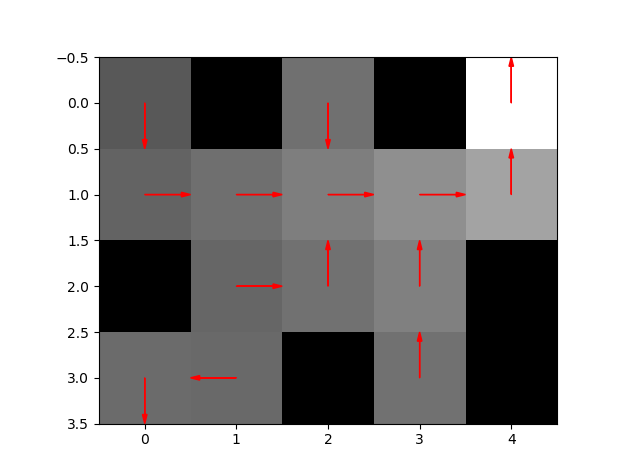  | 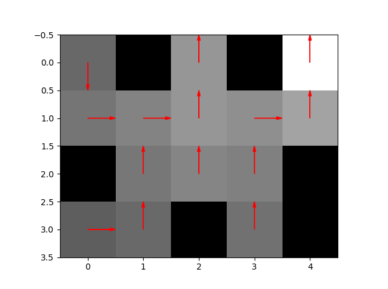  | 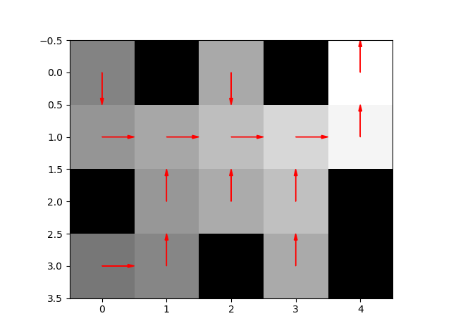  

### Maze Graphical Results

| Step size vs Number of iterations | Reward vs Number of iterations | RMSE vs Number of iterations |
| ----------- | ----------- | ----------- |
| 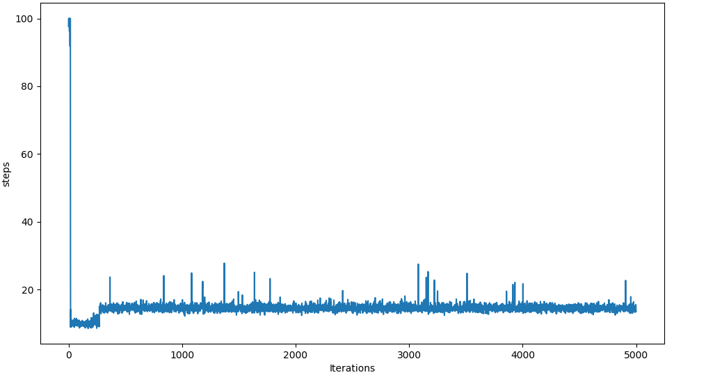 | 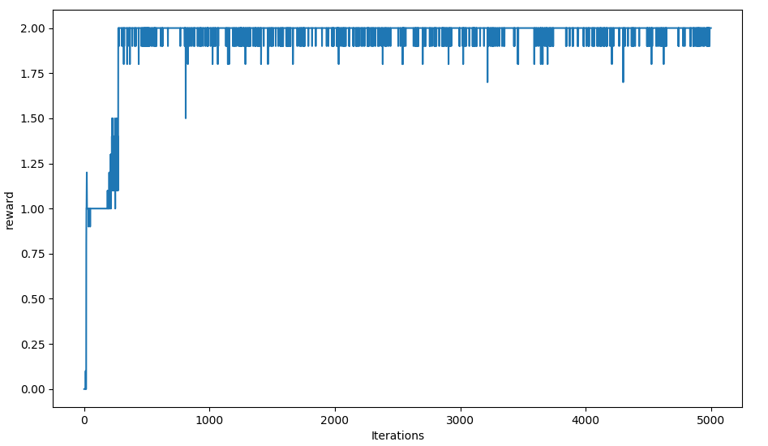 | 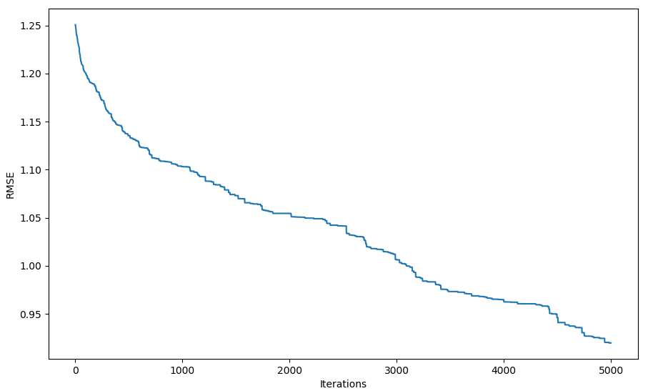 |

### MountainCar Results

Scikit-Learn was used to convert a state space to a featurized representation. Here RBF kernels with different variances were used to cover different parts of the continuous state space.

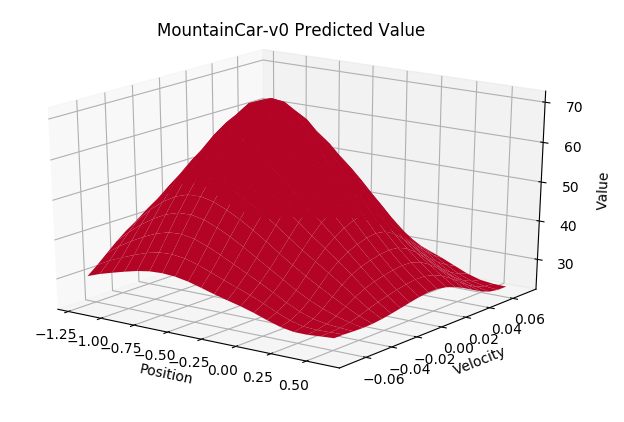 

The reward value for MountainCar-v0 lies in the range `[-97, 124]`. This value is recorded after running the Q-Learning algorithm multiple times. The range is smoothed over 25 iterations.

| Predicted values across state space | Iterations per episode |
| ----------- | ----------- |
| 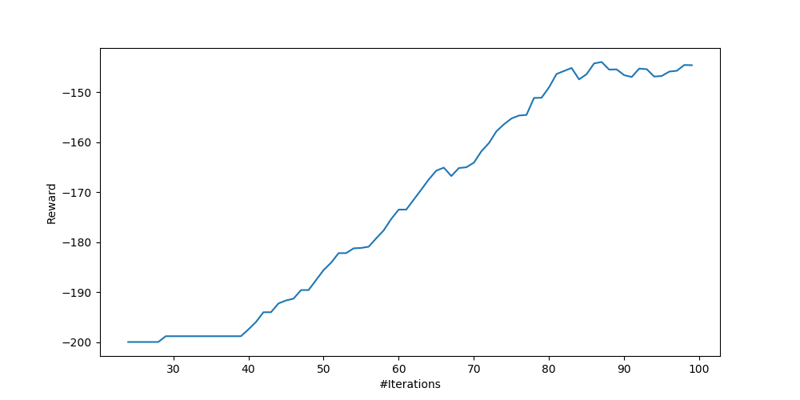 | 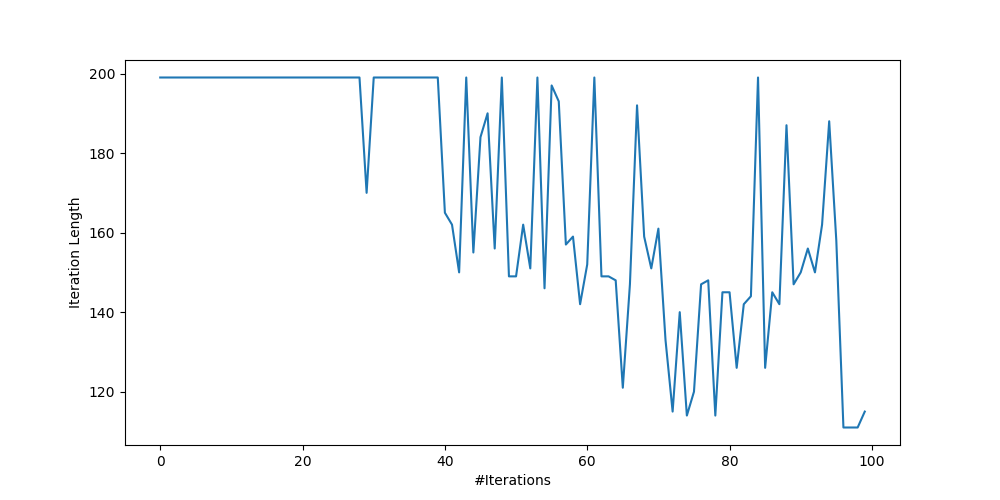 |

### Acrobot-v1 Results

Same as MountainCar, Scikit-Learn was used to convert a state space to a featurized representation. Here RBF kernels with different variances were used to cover different parts of the continuous state space.

The reward value for Acrobot-v1 lies in the range `[-162, 197]`. This value is recorded after running the Q-Learning algorithm multiple times. The range is smoothed over 25 iterations.

| Predicted values across state space | Iterations per episode |
| ----------- | ----------- |
| 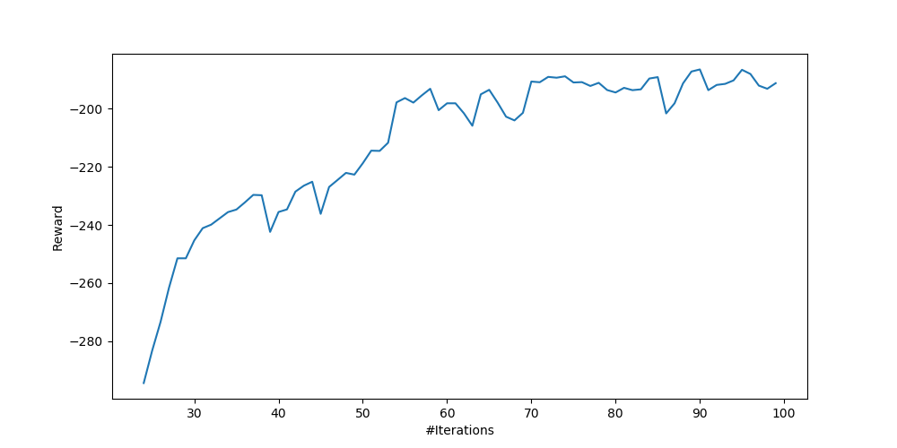 | 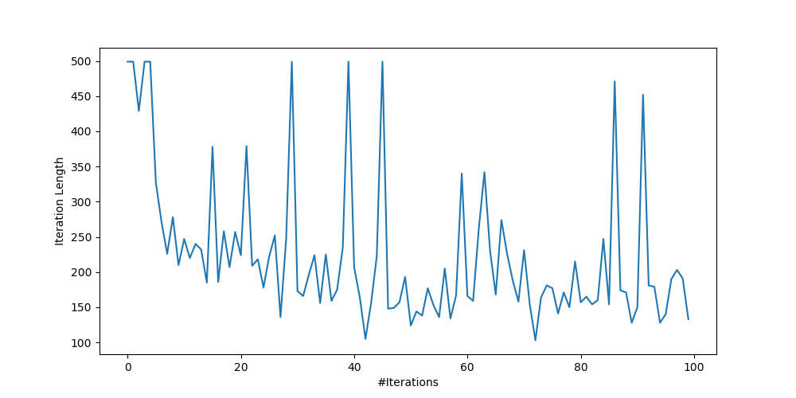 |

## References
Dr. Daniel Lee's ESE 650 Lecture Slides
